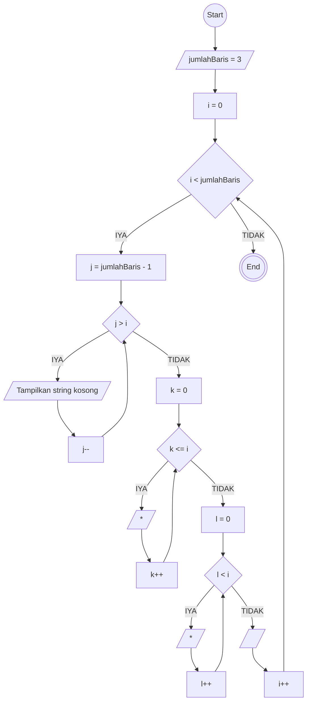

## For Loop

```mermaid
flowchart TD
  start((Start))
  baris[/jumlahBaris = 3/]

  init1[i = 0]
  for1{i < jumlahBaris}

  init2[j = jumlahBaris - 1]
  for2{j > i}
  out2[/Tampilkan string kosong/]
  dec2[j--]

  init3[k = 0]
  for3{k <= i}
  out3[/*/]
  inc3[k++]

  init4[l = 0]
  for4{l < i}
  out4[/*/]
  inc4[l++]

  out1[/\n/]
  inc1[i++]

  finish(((End)))

  start --> baris --> init1 --> for1
  for1 -- IYA --> init2 
  for1 -- TIDAK --> finish 

  init2 --> for2
  for2 -- IYA --> out2 --> dec2 --> for2
  for2 -- TIDAK --> init3

  init3 --> for3
  for3 -- IYA --> out3 --> inc3 --> for3
  for3 -- TIDAK --> init4

  init4 --> for4
  for4 -- IYA --> out4 --> inc4 --> for4
  for4 -- TIDAK --> out1

  out1 --> inc1 --> for1
```